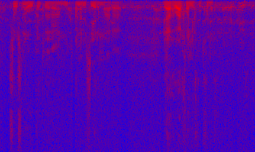
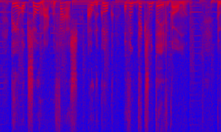
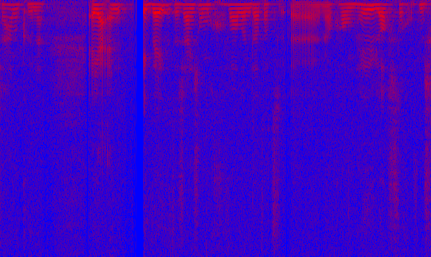
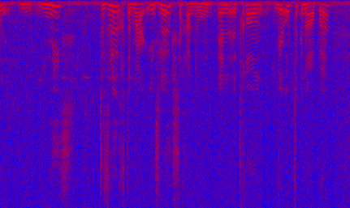

# Distinguish audio from youtube channels by accent

We used a 2D CNN on spectrograms of audio data to distinguish Dutch as spoken in the east and north of the Netherlands, by gathering data from the youtube channels of RTV Oost and RTV Noord. We reach around 77% accuracy on a balanced data set.

## Participants

 * dr. Martijn Wieling, principal investigator, University of Groningen, Faculty of Spatial Sciences
 * MSc Herbert Teun Kruitbosch, data scientist, University of Groningen, Data science team
 * MSc Aki Kunikoshi, data scientist, University of Groningen, Data science team

(The data science team is a group of 10 data scientists and alike that assist researchers from all faculties with data science and scientific programming, as part of the universities Center of Information Technology)

## Project description

**Goal** We wish to distinguish two Dutch accents, as spoken in the east of Overijsel and Gelderland, and as spoken in Groningen.

**Data** We downloaded 2,115 and 1,663 videos from RTV Oost and Noord respectively. The automatic subtitles were also downloaded, to identify timeframes were there was speech. These were cut out into 10,291 and 10,845 parts respectively with a sampling rate of 22050 Hz. This way we would not be training to seperate jingles or background noise.
 
**Model**

The model processes the audio segment into a spectrogram with stride 256, window size 512 and 512 FFT coefficients. Some examples are shown in Figure 2.

This is then passed to a CNN with

 * 32 filters of 7x7 convolutional layer with ReLU activation
 * maximum pooling of 25x17
 * 0.5 dropout
 * 32 filters of 10x10 convolutional layer with ReLU activation
 * 0.5 dropout
 * dense sigmoidal layer for classification.

<table>
  <tr>
    <td></td>
    <td></td>
    <td></td>
    <td></td>
  </tr>
  <tr>
    <td colspan="2">From RTV Oost</td>
    <td colspan="2">From RTV Noord</td>
  </tr>
  <tr>
    <td colspan="4">Figure 1. Example spectograms</td>
  </tr>
</table>
 
 
**Results** We've reached around 77% accuracy with these performance metrics:

|              | precision |    recall |  f1-score | support |
| -------------|-----------|-----------|-----------|---------|
|     RTV Oost |      0.85 |     0.64  |    0.73   |    794  |
|    RTV Noord |      0.72 |     0.89  |    0.80   |    825  |
|              |           |           |           |         |
|     accuracy |           |           |    0.77   |   1619  |
|    macro avg |      0.79 |     0.77  |    0.77   |   1619  |
| weighted avg |      0.79 |     0.77  |    0.77   |   1619  |

## Implementation

**Dependencies** Our code is based on `Python 3`, `Keras` and common libraries in this context like `matplotlib`. We also used `Kapre` to process the audio to spectrograms.

**Code**

 * [processing data](code/process_data) into batches which fit into memory.
 * [training](code/train_model.py)
 * [evaluation](code/evaluate.py)

